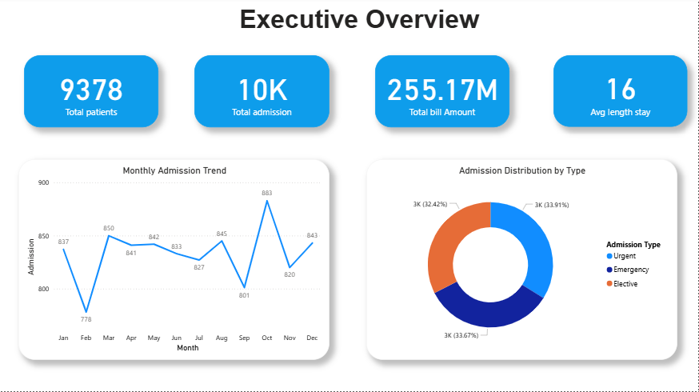
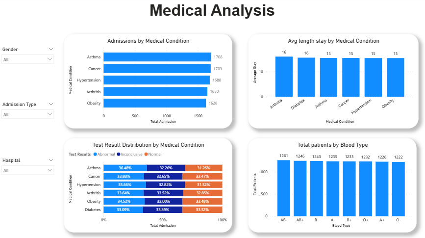

# 🏥 Healthcare Analytics Dashboard – Power BI

## 📌 Project Overview
This project presents an end-to-end healthcare analytics dashboard built using **Power BI**.  
The objective was to analyze patient data, hospital performance, and financial metrics to generate actionable insights.

The dataset contains over **10,000 healthcare records**, including:
- Admission details
- Medical conditions
- Billing information
- Hospital data

---

## 📊 Dashboard Pages

### 1️⃣ Executive Overview
- Total Patients
- Total Admissions
- Total Revenue
- Average Length of Stay
- Monthly Admission Trend
- Admission Type Distribution

### 2️⃣ Medical Analysis
- Admissions by Medical Condition
- Average Length of Stay by Condition
- Test Result Distribution
- Blood Type Analysis
- Interactive Filters (Gender, Admission Type, Hospital)

### 3️⃣ Financial Analysis
- Revenue Trend by Month
- Revenue by Hospital (Top 5)
- Revenue by Admission Type
- Revenue by Medical Condition
- Average Billing per Admission

---

## 🛠 Tools & Technologies
- Power BI
- DAX
- Power Query
- Data Modeling
- Data Visualization

---

## 📈 Key Insights
- Revenue remains stable throughout the year, with a peak in October.
- Urgent admissions generate slightly higher revenue.
- Average hospital stay is approximately 16 days.
- Medical conditions show relatively balanced admission distribution.

---

## 📷 Dashboard Preview

## Executive Overview

## Medical Analysis

## Financial Analysis

